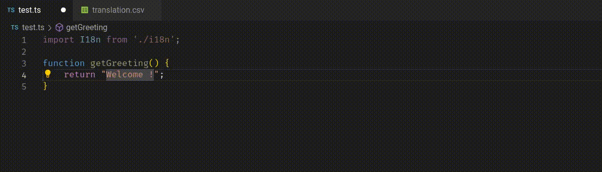

# quick-i18n-gen README

This Extension provides a quick way to translate and replace string literals in your code.

## Features

- Tooltip in VSCode for quickly replacing string literals with a translation key
- Quick and automatic translation of said string literals using a Translation API
    - Currently supported APIs: **DeepL**
- Automatically add translations with key to your translation file
    - Currently supported file types: **CSV**

Usage of the library would look like this

## Requirements

You need an API key for Deepl, which is free up to a certain amount of translations.

## Setup

1. Set and register your API. Can be done via settings or via the `Register Translation API` command.

2. Select the translation file. Can be done via settings or via the `Select Translation File` command.

3. Select the target languages. Currently, this can only be done through the settings

## Extension Settings

* `quick-i18n-gen.apiProvider`: API Provider to use for translation. Currently only Deepl available.
    * `quick-i18n-gen.deepl.apiKey`: API Key for DeepL Translation API
    * `quick-i18n-gen.deepl.sourceLanguage`: Source language for translation. If left empty, auto-detects the language of the text.
    * `quick-i18n-gen.deepl.targetLanguages`: Target languages for translation. Translations will be written to the file in order specified here.
* `quick-i18n-gen.translationFilePath`: Path to the translation file.
* `quick-i18n-gen.translationFileType`: File type of the translation file. Currently only CSV supported.
    * `quick-i18n-gen.csv.separator`: Separator for CSV file.
    * `quick-i18n-gen.csv.quote`: Quote character for CSV file.
    * `quick-i18n-gen.csv.escape`: Escape character for CSV file.
    * `quick-i18n-gen.csv.header`: Whether CSV file has a header or not.
* `quick-i18n-gen.allowDuplicates`: Whether to allow duplicate translations or not.
* `quick-i18n-gen.replacementString`: String template to replace the string literal with.

## Release Notes

### 1.0.0

Initial release

- [x] Added Deepl API
- [x] Added CSV file type
- [x] Added general settings
- [x] Added translation file selection
- [x] Added string code actions

